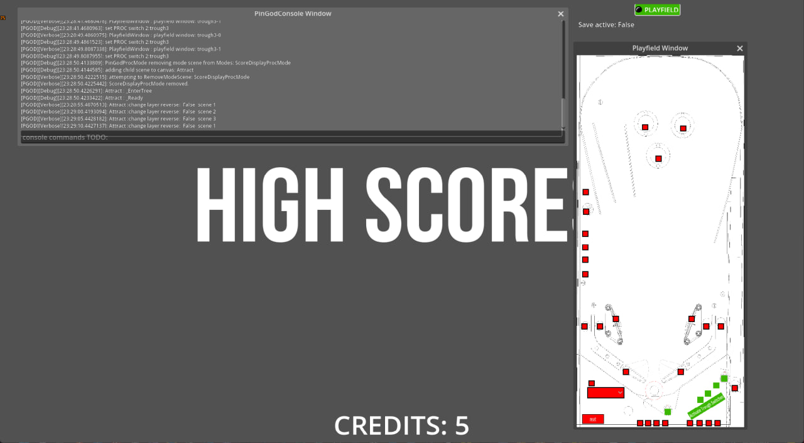

# PinGod-AddOns-NetPinProc-Game
   

Godot Addons for extending the 🔗[pingod-addons](https://github.com/FlippingFlips/pingod-addons) and using the 
🔗[NetPinProc Libraries](https://github.com/FlippingFlips/NetPinProc)for P-ROC controlling real or fake pinball controller boards.

## Quick Start - Demo Test
- Download and run the windows game demo in 🔗[releases](https://github.com/FlippingFlips/pingod-addons-netpinproc/releases). **(Godot isn't required)**
- Keys: 5 = coin, 1 = start. Fill ball trough before starting
(use the switch window to fill trough, all can be filled at once with the big button)
- Keys: 0 = enter (vol or service mode, depending on coin door)
- Keys: 7 = exit. 8 = down, 9 = up
- Keys: ESC to exit window
- Use the plunger lane switch in switch after launching balls to activate a ball save for that ball

This game should also work with visual pinball providing you have the COM controller,
see the `pingods-addons` demo on how to setup a connection between the two.

## About
This project uses the 🔗[NetPinProc.Game.Sqlite](https://github.com/FlippingFlips/NetPinProc/tree/main/NetPinProc.Game.Sqlite)
package which includes `NetPinProc.Game` and `NetPinProc`. 
This project also relies on the `pingod-addons` being in an `addons` folder for this Godot project.
The files here build on from those addons.

### Directories Overview
- [addons/netpinproc*](addons) contains base implementations for PROC and PinGod with PROC with :link: [pingod-addons](`https://github.com/FlippingFlips/pingod-addons`) overrides.
- [autoload](autoload) contains scenes which can override the addons scenes.
- [netpinproc-game](netpinproc-game) contains custom game classes and files with scenes and example modes.

### Other directories
- [lib](lib) these files are only required when running real P-ROC controller boards with 🔗 [libpinproc](https://github.com/FlippingFlips/libpinproc)
- [simulators](simulators/visual-pinball) files for simulator like Visual Pinball and PinGod controller
- [sql](sql) shipped with library, change to add your own machine configuration.
Set the `.cfg` file to delete on launch if you need to.

## Quick Dev Start

1. Download the repo or clone
2. Download the addons folder from `pingod-addons`
3. Load project with Godot from this directory running `godot -e`
4. Build the project. Run to get errors if no PROC is connected.
5. A database has been generated and a `PinGod-AddOns-NetPinProcGame.cfg`
6. You can change the config for `Simulated` boards and how the database is generated / removed
  
  **A `{projectname}.cfg` is generated when the game is launched. This makes it simpler to override settings like simulated and memory mapping by editing this file in the root directory.**
6. Change simulated in the `cfg` in Godots editor to run a fake P-ROC.

  **A Sqlite Database is generated when a game is launched. `netproc.db` = Edit .sql file and add machine items. The sql provided matches the same cabinet configuration as `pingod-addons`.**

## Screens

